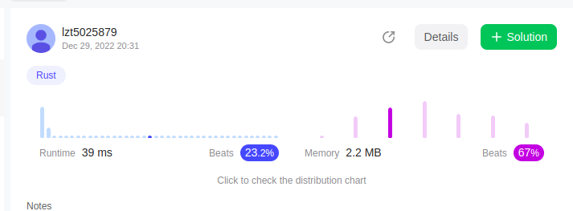
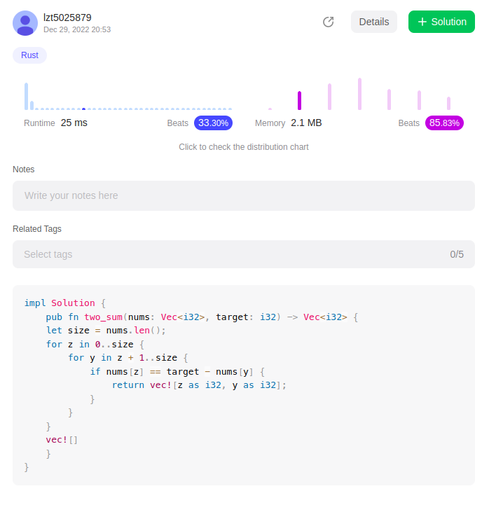
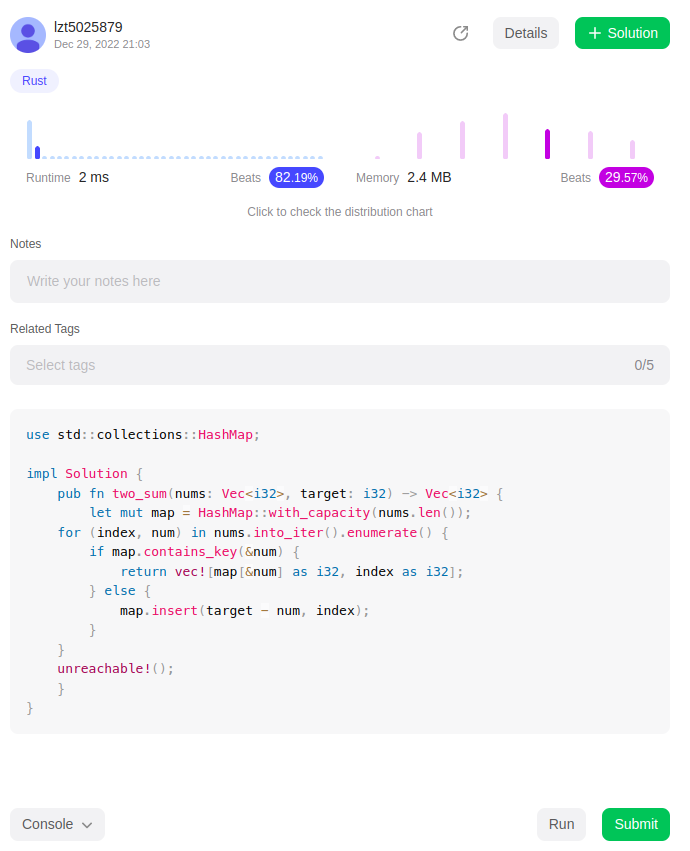

# 1. Two Sum

    Given an array of integers nums and an integer target, return indices of the two numbers such that they add up to target.
    You may assume that each input would have exactly one solution, and you may not use the same element twice.
    You can return the answer in any order.

# Constraints

     2 <= nums.length <= 104
     -109 <= nums[i] <= 109
     -109 <= target <= 109
     Only one valid answer exists.

> Examples 1:

    Input: nums = [2,7,11,15], target = 9
    Output: [0,1]
    Explanation: Because nums[0] + nums[1] == 9, we return [0, 1].

# Analyse words

    We use Rust language syntax:
    I think the output of this function is a array of indices of the two numbers.
    So we must use the enumerate function.
    Solution1:
        most stupid function :
            two for function
            waste too many computation
            low memory usage and too much computation

    Solution2:
    Less stupid function :
    Lower computation jumps some indices

    Solution3:
        Looking for hotest solution in the Leetcode
        Use hashmap function
        that's fking quick!

