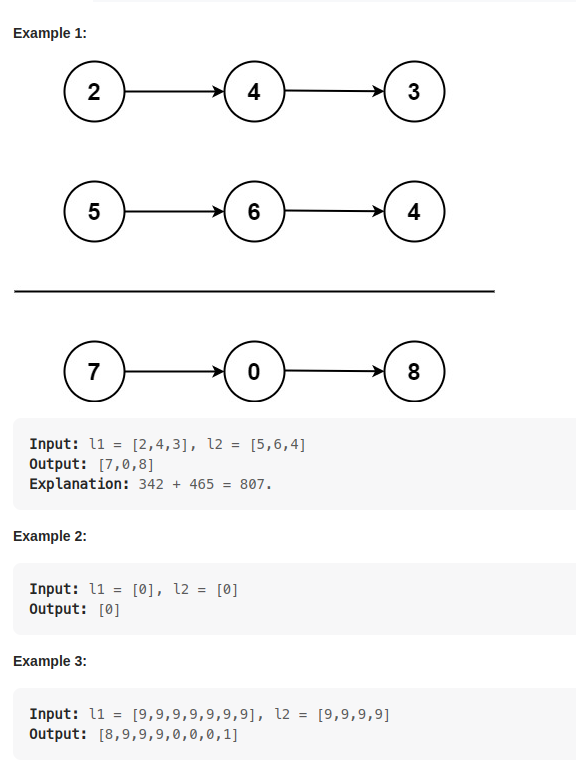

# 2. Add Two Numbers

    You are given two non-empty linked lists representing two non-negative integers. The digits are stored in reverse order, and each of their nodes contains a single digit. Add the two numbers and return the sum as a linked list.
    You may assume the two numbers do not contain any leading zero, except the number 0 itself.

    Solution1:
        remember (node0 + node1) % 10
        make a  zero node end return the next

    Solution2:
        three kinds :
            input1 -> some input2 -> some
            input2 -> Some input2 -> None  |   input2 -> None input2 -> Some
            input2 -> None input2 -> None

