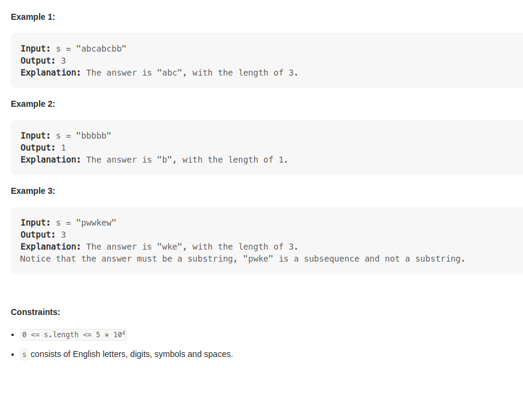
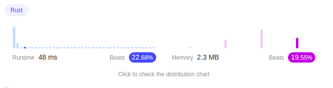

# Problem 3 : Longest Substring Without Repeating Characters

    Given a string s, find the length of the longest
    substring without repeating characters.

# Solution1:

    at the rust-syntax , first can use as_bytes()  iter()
    enumerate()

