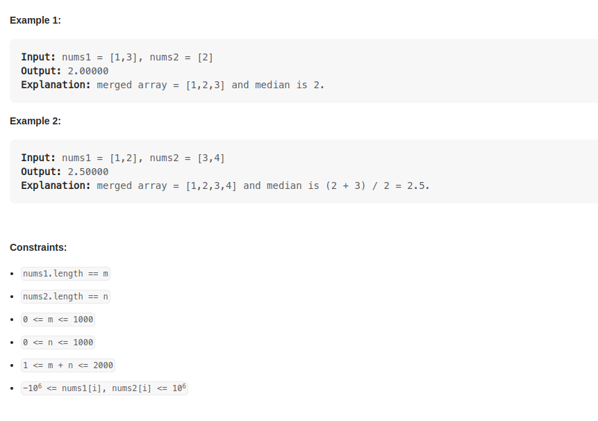

# Problem 4 : Median of Two Sorted Arrays

    Given two sorted arrays nums1 and nums2 of size m and n respectively, return the median of the two sorted arrays.
    The overall run time complexity should be O(log (m+n)).

# Analysing :

    1. two sorted arrays
    2.run time complexity should be O(log(m+n)).
    That means you cant cycle through those arrays
    Put two arrays into a array, and sort them.
    find the median index of the array.
    and couculate the median value .

