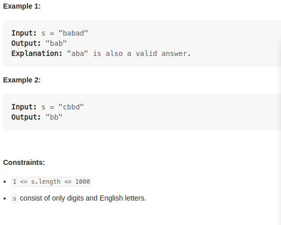

# 5. Longest Palindromic Substring

    Given a string s, return the longest palindromic substring in s.

# Solution 01

    1. make a function that returns wether the string is a palindromic or not.
    2.
